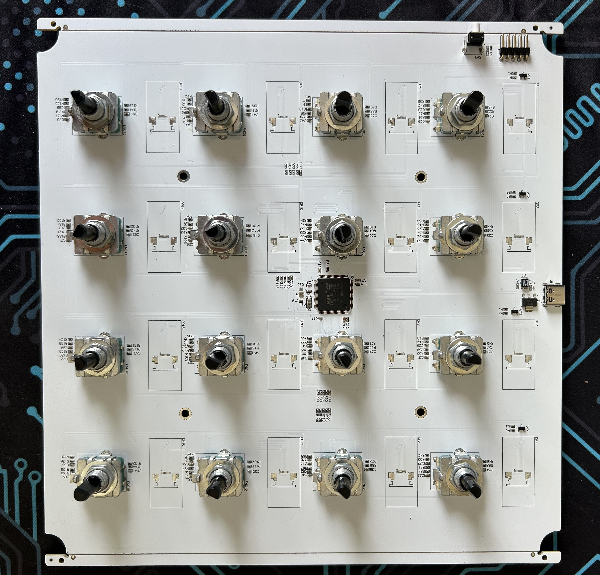
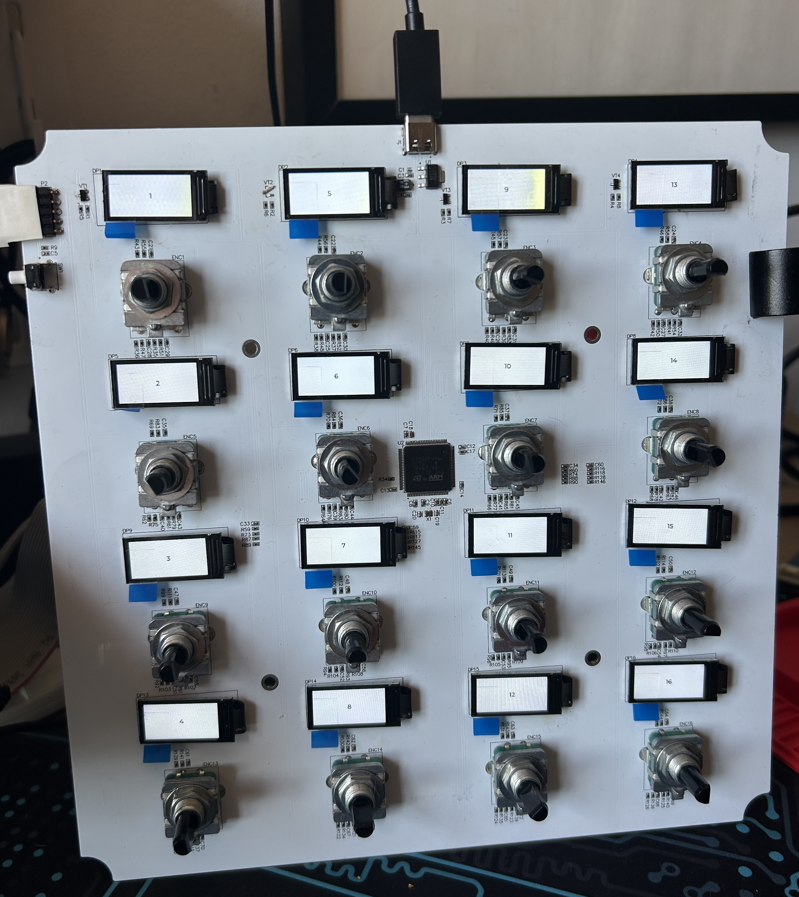

### STM32 16-Display x 16-Encoder MIDI Controller

Repo contais firmware & hardware sources for USB-MIDI device with 16 rotary encoder & 16 TFT LCD displays. Device is running on STM32F446 MCU

##### PCB

##### Board bringup

##### Assembled prototype

#### Demo video

https://github.com/user-attachments/assets/f20548df-196e-4dba-a797-96f6a022c965

https://github.com/user-attachments/assets/a411a721-85d3-416d-b7c8-644320bd57e6
