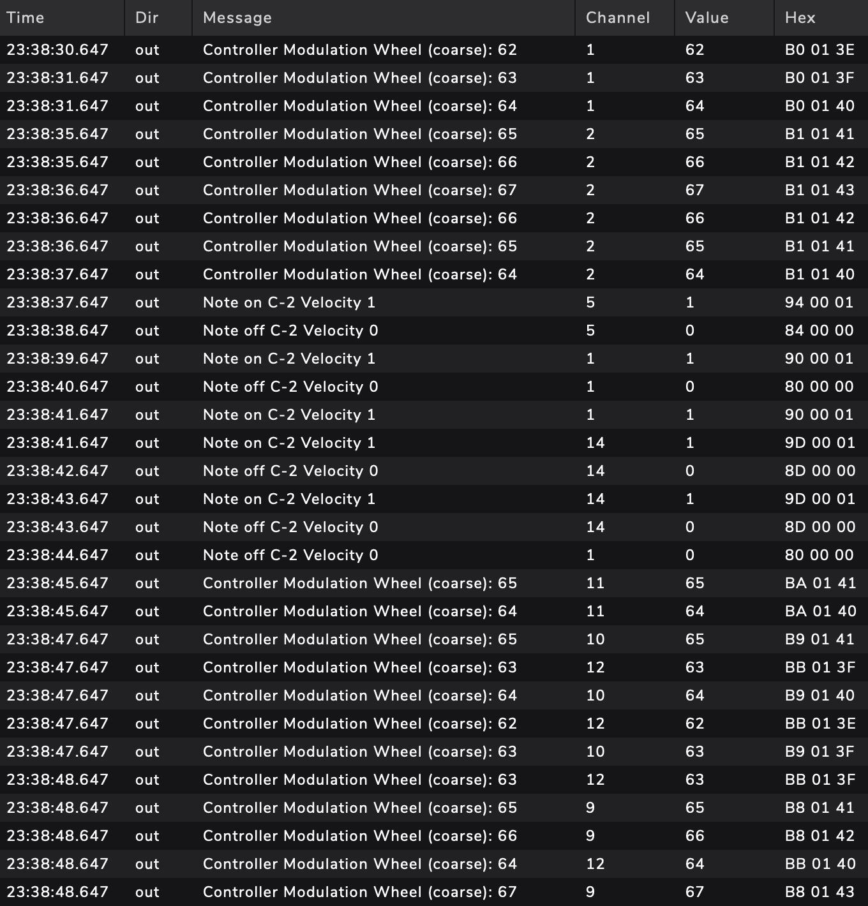
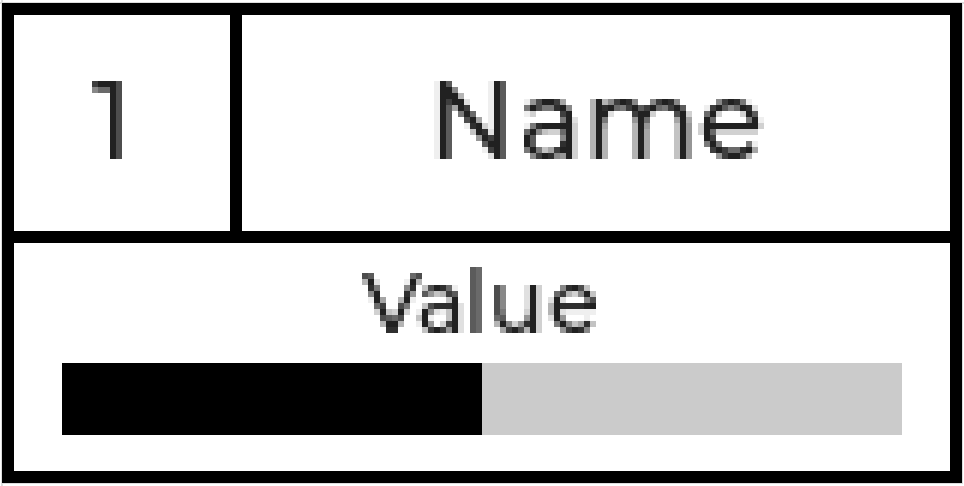

### STM32 16-Display x 16-Encoder MIDI Controller

Firmware for composite USB device with MIDI & Serial interface running on STM32F446 MCU. Device has 16 rotary encoder & 16 TFT LCD displays (160x80px).

##### MIDI Interface

On every encoder event device sends MIDI commands to the connected USB host. Easiest way to check MIDI commands is using MidiView app.

##### Display Elements

Each of 16 displays has channel, name, value and bar elements.

##### Serial Interface

Device supports a set of commands to setup interface fields through serial port. Each command is an ASCII-string with '\n' terminator. 

| Command                  | Parameters                                                   |
| ------------------------ | ------------------------------------------------------------ |
| `/set/value/{x}/{y}`     | {x} - display id {y} - value                            |
| `/set/level/{x}/{y}`     | {x} - display id {y} - bar level                        |
| `/set/channel/{x}/{y}`   | {x} - display id {y} - channel                          |
| `/set/name/{x}/{y}`      | {x} - display id {y} - name                             |
| `/set/color/{x}/{y}/{z}` | {x} - display id {y} - color element: "bg", "text", "border", "bar" {z} - RGB color in hex, e.g. - "ff0000" - red, "ffffff" - white, etc. |

##### Interface example

##### Demo

https://github.com/user-attachments/assets/066187ef-49a9-449c-b158-acdf62c2ad6f

##### Board Bringup

    

##### TODO 

- MIDI channel configuration

##### 
